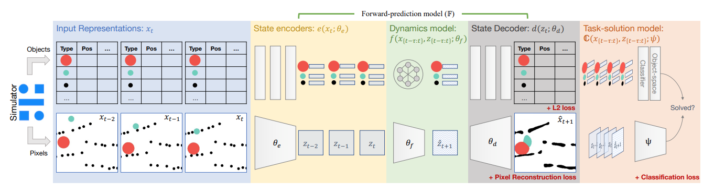

# WMQ

# TYY

# WLH

# GKZ

# GCY

## 后续工作 

### Virtual Tool

我找了大半天，也没找到有什么发表的论文基于virtual tool去做的，只找到了原作者19年发表在ICLR上的前期工作

#### RAPID TRIAL-AND-ERROR LEARNING IN PHYSICAL PROBLEM SOLVING

- `论文链接` https://eringrant.github.io/spirl/2019/camera-ready/spirl_camera-ready_19.pdf
- `目标问题` 与virtual tool完全一致，通过在场景中放置类似工具的物体来解决物理难题，进行快速试错学习，与人类的较少次数测验进行对比。
- `提出方法` 
- 1. **SSR(Sample, Simulate, Remember)**
    - Sample: 基于对象的先验采样（Object-based prior）
      - 提供统一先验：三种工具选择的均匀分布。
      - 工具位置的采样基于场景中可移动物体的数量，均匀选择目标对象。
      - 工具的x和y坐标则从采样对象的坐标中加入高斯分布噪声生成。
    - Simulate: 带噪物理模拟引擎（Noisy Simulation Engine）
      - 引入碰撞噪声（collision elasticity & collision direction），模拟现实中的不确定性。
      - 对同一动作随机模拟5次，并记录目标区域与相关物体的最小距离。
      - 如果平均最小距离小于阈值，则认为该动作可在实际场景中尝试。
    - Remember: 使用贝叶斯优化进行高效采样（Bayesian Optimization for Efficient Sampling）
      - 用**高斯过程（Gaussian Process）**将action与estimated rewards(目标区域与相关物体的最小距离)映射起来。
      - 利用贝叶斯优化策略生成新的动作提议，平衡探索未知动作和利用已有高效动作之间的关系。
- 2. **PPO**
    - 输入: 场景图像和工具图像。
    - 奖励系数:
      - -10：不合法动作。
      - -5：动作对场景无影响。
      - 0：任务成功。
    - 实验结果:
      - PPO能学习到每个关卡的合法策略，但未能为同类型的关卡学会通用的解决策略。
      - 尽管PPO尝试次数较多，但在多次观察后仍缺乏对关卡类型的归纳能力，表现出低效率。

### PhyRe

PhyRe的相关工作较多，除了小朱组的I-PhyRe外，还有meta自己做的PhyRe-Fwd和PhyRe-DynamicsAware，不过很可惜，原作者在之后就不愿意再做相关工作了。

#### Forward Prediction for Physical Reasoning

- `论文链接` https://arxiv.org/pdf/2006.10734
- `目标问题` 提出如何在PHYRE基准任务中放置工具（如球体）以达到特定目标（如使两个球接触至少三秒），从而研究物理推理中通过**前向预测（Forward Prediction）**来解决复杂问题的能力，并加入了对unseen任务模版的泛化能力测试
- `提出方法` 
  - 基于 Forward Prediction 设计了两种模型——Object-based Model和Pixel-based Model
  - 
  1. **Object-based**
    在像素准确率（FPA）上优于像素级模型。
    - Interaction Networks
      - 使用图神经网络对对象间关系建模。
      - 特征包括对象的类型、位置、速度等，通过MLP对对象间的相互作用进行建模。
      - 通过累积的效应汇总到一个MLP中来预测对象的未来状态。
    - Transformer
      - 用两层MLP对每个对象的状态进行编码
      - 利用自注意力机制对对象间复杂交互进行建模。
      - 加入时间编码以捕获时序特征，通过Transformer层对未来状态进行预测，利用MLP解码输出来获得未来状态。
    - Tx-Cls
      - 使用Transformer建模对象间关系，预测是否完成任务。
  2. **Pixel-based**'
    在任务完成率（AUCCESS）上表现更好，特别是在复杂场景中。
    - Spatial Transformer Networks
      - 使用连通组件算法分割场景中的对象，并预测每个对象的旋转和平移。
      - 合并所有对象预测生成下一帧场景。
    - Deconvolutional Networks
      - 使用解卷积网络直接生成下一帧像素值。
      - 不依赖分割，支持端到端训练。
    - Conv3D-{Latent, Pixel}
      - 视任务为视频分类问题，通过3D卷积网络处理时序信息。
  3. **Search Strategy** 
    - 使用前向预测模型和任务解决模型生成评分函数，评分最高的动作被选为解决方案。
    - 提供1000个候选动作，依赖前向预测结果评估其解决任务的可能性。
  

#### Physical Reasoning Using Dynamics-Aware Models

- `论文链接` https://arxiv.org/pdf/2102.10336
- `目标问题` 探讨如何在物理推理任务中提高模型对动态场景中物体交互的理解和推理能力，在无需精确动态预测的情况下提升物理推理任务的性能。
- `提出方法`
  - 结合Dynamics-agnostic和Dynamics-modeling方法的优势开发a dynamics-aware approach，将模拟器的rollout纳入到DQN的训练中
  1. **Dynamics-Aware DQN**
    - 基于标准DQN，增加一个动态感知损失函数，用于捕获场景中物体的动态信息。
    - Network Structure:
      - 使用ResNet作为backbone，将初始场景输入编码为特征嵌入。
      - action通过MLP编码，与ResNet嵌入进行融合（使用FiLM模块），生成场景-动作嵌入。
      - 通过线性层对动作评分，使用逻辑损失判断动作是否能完成任务。
    - **Dynamics-aware Loss**
      - Hand-crafted Dynamics-aware Loss
        - 定义两次场景滚动（rollout）的相似性，计算对象在滚动中的欧氏距离，并通过函数转换为相似度。对每对动作生成相似性分布，通过交叉熵损失逼近真实分布。
      - Self-supervised Dynamics-aware Loss
        - 使用对比学习方法，仅依赖像素级信息，不需对象的真实状态。动作嵌入与rollout后的场景嵌入进行匹配，设计对比损失优化嵌入空间，使相似场景靠近，非相似场景分开。

#### I-PHYRE: INTERACTIVE PHYSICAL REASONING

- `论文链接` https://openreview.net/pdf?id=1bbPQShCT2
- gkz看过了，我就先跳过

## 相近工作

在文章《Benchmarks for Physical Reasoning AI》(https://arxiv.org/pdf/2312.10728)列出了16种针对Physical Reasoning的benchmark，其中包含PHYRE和Virtual Tools，论文中提到说PHYRE和Virtual Tools是完全一样的settings(Concept--Collision, Falling; Variables--Global, Immediate, Temporal; Scene--2D simplistic)，而相近的settings还有**Phy-Q**(Scene--2D realistic), **CRAFT**(一致)

### Phy-Q

- `论文链接` https://www.nature.com/articles/s42256-022-00583-4.pdf
- `Settings`
  - Phy-Q要求agent与环境交互，解决 75 个物理"愤怒的小鸟"模板，涵盖 15 个不同的物理概念。在这些 "愤怒的小鸟 "场景中，任务始终是用提供的一组小鸟消灭场景中的所有猪。为了实现这一目标，agent必须提供弹弓的相对释放坐标和激活小鸟能力的时间点作为行动。在某些情况下，agent必须按照自己选择的顺序射杀多只鸟。agent可以观察到的是环境截图和物体的符号表示，其中包含物体顶点的多边形和颜色图。
- `Baseline & Solution`
  - DQN: agent 可以通过 CNN 学习状态表示，也可以使用符号化 json 场景描述状态。与使用卷积帧编码器相比，符号化agent的表现明显更好
  - Improvement: Pretrained ResNet-18 来提取第一帧的特征 + Multi-head dot product attention

### CRAFT

虽然它的settings和上面两个类似，但是整体差别还是很大，输入输出都很不相似

- `论文链接` https://arxiv.org/pdf/2012.04293
- `Settings`
  - CRAFT 数据集是关于短视频中呈现的物体物理交互的问答基准。该数据集包括 57000 个视频，以及从 20 个不同二维场景的 10000 个视频生成的问题对。模拟剧集的表示形式涉及不同的数据结构：视频帧和剧集中用于生成问题的事件的因果图。场景的初始和最终状态是指对象属性，包括模拟开始时/结束时对象的颜色、位置、形状和速度。提供此信息是为了在  benchmark 中成功回答。
- `Baseline & Solution`
  - R3D with a pretrained ResNet-18 CNN base to extract information from a down-sampled video version. 
    1. 文本信息使用 LSTM 提取。文本和视觉信息被传递给一个MLP
    2. 使用记忆、注意力和合成（MAC）模型同时处理文本信息和视觉信息